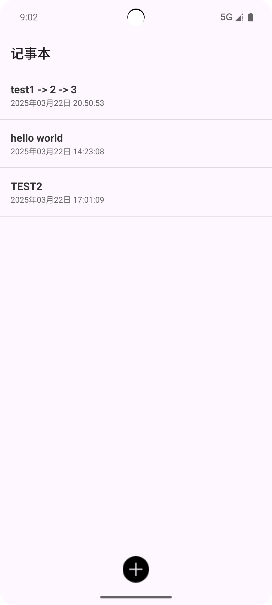
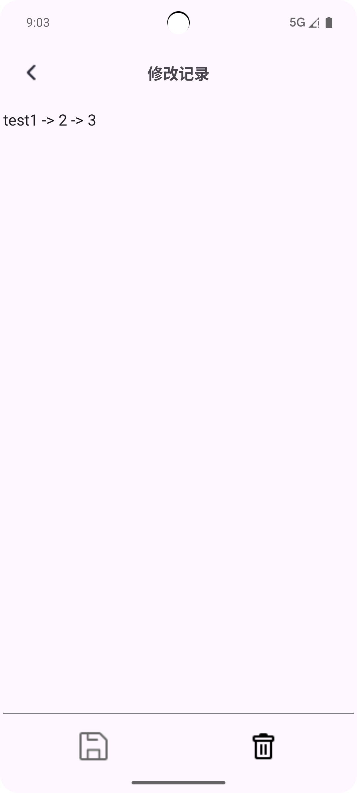
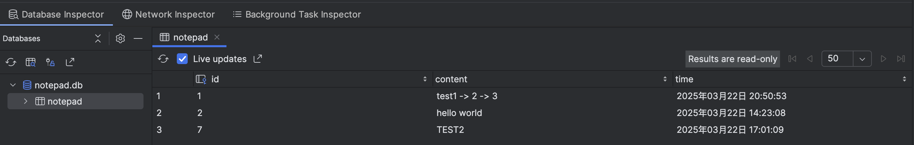
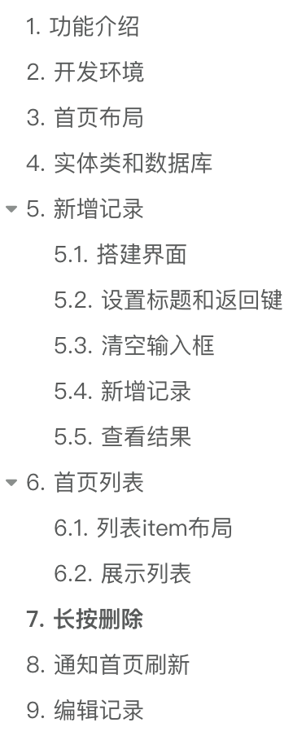

# NotepadApp - 简洁高效的安卓记事本应用 📝

一款基于Android开发的轻量级记事本应用，支持记录创建、编辑、删除及实时刷新功能，采用SQLite数据库进行数据存储。

## 功能特性 ✨
- **新增记录**：快速添加记事内容，自动记录创建时间  
- **首页列表**：以卡片形式展示所有记事，支持滑动浏览  
- **长按删除**：长按条目弹出确认对话框，防止误操作  
- **即时编辑**：点击条目跳转编辑页，修改内容自动更新  
- **数据持久化**：采用SQLite数据库存储，确保数据安全  
- **时间记录**：精确到秒的时间戳记录（北京时间）  

## 应用截图📖

### 主界面



### 编辑界面



### 数据库



## 技术栈 🛠️

- **开发环境**：Android Studio | JDK 17 | Gradle 8.0
- **架构组件**：RecyclerView | ViewBinding | SQLiteOpenHelper
- **工具类库**：Lombok（@Data注解）| Material Design 组件
- **时间处理**：SimpleDateFormat（上海时区）

## 项目结构 📂

```bash
com.loliowo.notepadapp
├── adapter         # RecyclerView适配器
│   └── NotepadListAdapter.java
├── bean            # 数据实体类
│   └── Notepad.java
├── db              # 数据库操作类
│   └── MyDbHelper.java  
├── ui              # 界面相关
│   ├── MainActivity.java 
│   └── EditActivity.java
├── utils           # 工具类
│   └── TimeUtil.java
└── databinding     # ViewBinding生成类（自动）
```

## 编写流程✏️



## 快速开始 🚀

1. **克隆仓库**
   ```bash
   https://github.com/mintoneko/Android-Notepad

2. **导入项目**
   - 使用Android Studio打开项目目录
   - 同步Gradle依赖（自动下载Lombok插件）

3. **构建运行**
   - 连接Android设备或启动模拟器（API 26+）
   - 点击 ▶ Run 按钮编译安装

## 核心实现 🔍
### 数据库设计
```sql
CREATE TABLE notepad(
  id INTEGER PRIMARY KEY AUTOINCREMENT,
  content TEXT,
  time TEXT
)
```

### 数据流示意图
1. **新增记录**  
   `EditActivity` → `MyDbHelper.insert()` → 刷新`MainActivity`列表

2. **编辑记录**  
   `MainActivity` → 传递Serializable对象 → `EditActivity.update()`

3. **删除逻辑**  
   
   ```java
   // 长按触发AlertDialog确认
   mainActivity.myDbHelper.delete(notepad);
   mainActivity.findAll(); // 立即刷新列表
   ```

## 许可证 📄

[MIT License](LICENSE) © 2025 loliowo
